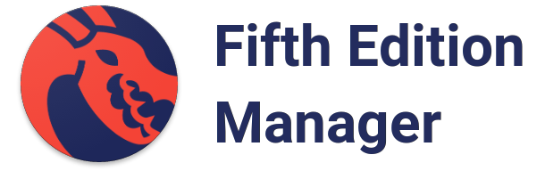

# Fifth Edition Manager

Fifth Edition Manager is a mobile app for managing your campaigns and characters. It is aimed towards GMs and players regardless of experience.

## Roadmap

### 0.1.0-alpha

**0.1.0-alpha** started out with a campaign creation process that covers basic character information. It was written for Android smartphones.

### 1.0.0-alpha

**1.0.0-alpha** aims for a react native application that separates the campaign and character creation process, facilitating management for GMs and players regardless of experience. Some proposed changes are described in detail below.

#### Overview

The user has 2 starting options: a campaign or a character. When getting together with others to plan out a campaign, you may not have the necessary details for the campaign to craft your character. Or perhaps you have one in mind, but don't know enough about the campaign. You can start anywhere you'd like and fill it out at your own pace.

#### Campaigns

Track every session of your campaign and see how your character(s) evolves over time.

- Character attachment
    - As a player, you'll build your character and attach it here to associate it with the campaign.
    - As the GM, you'll probably have many characters attached here. You won't need all the specific details - just enough to track combat and what not.
- Session management
    - Meeting metadata: e.g., date, time, duration, place, next expected session time
    - Notes: e.g., inventory changes, experience gained, session notes

#### Characters

Each character you build is a potential template. Save it for reuse if you'd like.

- Character information
- Character stats
- Character notes
- Guided mode (simple)
    - Good for new players who need help building their characters and players who want to track other notes and information with their characters digitally.
    - Slower process to create a character. Assumes you're interested in the information associated with the basics.
- Quick mode (advanced)
    - Good for GMs and players that want to build out their characters.
    - Very quick process to create a character. Assumes you know what you want and want it done.
